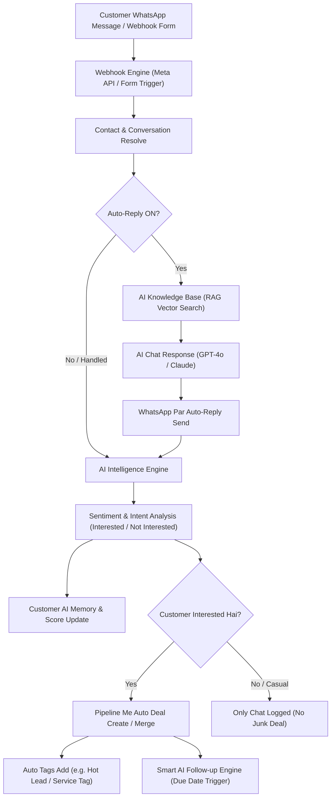

# 🤖 AI-Botflow-CRM: AI Kaise Kaam Karti Hai (Complete Documentation)
**Route:** `/agents` (Config tab), `/pipelines`, `/settings?tab=ai`

Yeh document aapke CRM me AI ke kaam karne ke pure process ko simple aur detail tarike se samjhata hai — customer ke pehle WhatsApp message ya Webhook lead aane se lekar, AI Qualification, Auto-reply, CRM Pipeline Deal Creation, aur Smart Follow-ups tak.

---

## 📑 Table of Contents (Vishy-suchi)
1. [AI ka Overall Architecture (Diagram)](#1-ai-ka-overall-architecture)
2. [WhatsApp Inbound Chat & Auto-Reply (RAG)](#2-whatsapp-inbound-chat--auto-reply-rag)
3. [AI Intelligence & Sentiment Analysis](#3-ai-intelligence--sentiment-analysis)
4. [AI Lead Qualification & Pipeline Deals](#4-ai-lead-qualification--pipeline-deals)
5. [AI Long-term Memory (Customer Yaadash)](#5-ai-long-term-memory)
6. [Smart AI Follow-up & Chat Summarizer](#6-smart-ai-follow-up--chat-summarizer)
7. [Human Handoff (Agent Kab Takeover Karta Hai)](#7-human-handoff-agent-takeover)
8. [Settings & Customization Guide](#8-settings--customization-guide)

---

## 1. AI ka Overall Architecture

CRM me AI ka flow step-by-step is tarah kaam karta hai:

---

## 2. WhatsApp Inbound Chat & Auto-Reply (RAG)

Jab koi customer aapke WhatsApp Business number par message karta hai:

### Step 1: Customer Pehchan
- System dekhta hai ki yeh customer pehle se contacts list me hai ya naya hai.
- Agar naya hai, to uska contact turant create hota hai aur conversation initialize hoti hai.

### Step 2: Knowledge Base (RAG - Retrieval-Augmented Generation)
- AI aapke **Knowledge Base** (jaise aapki pricing list, services, FAQs, company rules, product catalogues) me vector search karta hai.
- Cosine similarity matching ke through AI customer ke sawaal ke hisaab se exact information nikalta hai.

### Step 3: Natural Reply Send Karna
- AI bina generic lage, ek real sales executive ki tarah professional aur polite Hindi/English/Hinglish me WhatsApp par turant reply bhejta hai.
- **Safety Limit:** `auto_reply_max_per_conversation` setting ensure karti hai ki AI bina baat ke loop me na phase.

---

## 3. AI Intelligence & Sentiment Analysis

Har customer message aane par background me AI Intelligence Engine run hota hai. Yeh background process 4 mukhya cheezein detect karta hai:

| Detection | Kya Check Karta Hai | Example |
| :--- | :--- | :--- |
| **Sentiment** | Customer ka mood aur interest | `interested`, `neutral`, `not_interested`, `urgent` |
| **Intent** | Customer kya chahta hai | `pricing`, `booking`, `service_inquiry`, `complaint` |
| **Lead Score** | Lead kitni serious hai | 0 se 100 tak ka score (Interested hone par 85+ score) |
| **Service & Location** | Customer ki specific requirement | Album Design, Video Editing, City: Gopalganj, etc. |

---

## 4. AI Lead Qualification & Pipeline Deals

Purane CRMs me har "Hi" ya "Hello" bolne wale ka deal ban jata tha jisse pipeline clutter aur junk se bhar jati thi. **AI-Botflow CRM me Smart Lead Qualification engine hai:**

### Single Customer = Single Deal Rule (Auto-Merge)
- Agar ek customer 5 baar bhi message karega ya alag-alag form bharega, to uske 5 alag deals nahi banenge.
- AI us customer ke purane active deal ko detect karke **usi deal ke andar naye updates merge** kar deta hai. Pipeline clean rehti hai aur sales rep ko customer ki complete timeline ek hi jagah milti hai.

### Deal Kab Banti Hai?
1. **Interested Hone Par:** Jab customer booking, rate, quote, ya service details mangta hai (`isInterested = true`), tabhi deal banti hai.
2. **Casual Message Par Deal Nahi:** Sirf "Hi", "Good Morning" ya spam messages par koi deal create nahi hoti.
3. **Pipeline Flexibility:** Deal aapki pipeline ki **ID** se link hoti hai. Isliye aap apni pipeline ka naam kuch bhi rakhein, AI hamesha sahi pipeline aur uske pehle stage me deal banata hai.

---

## 5. AI Long-term Memory (Customer Yaadash)

Har contact ke paas ek **`ai_memory`** field hota hai:

- **Customer Preference Yaad Rakhna:**
  - Agar customer ne pehle kaha tha ki *"Mujhe 30 sheet wedding album chahiye aur delivery 15 tareekh tak chahiye"*, to AI is baat ko uske memory bank me store kar leta hai.
- **Context-Aware Responses:**
  - Jab customer 5 din baad dobara message karega, to AI use pehle ki conversation ke context ke sath treat karta hai, dobara basic sawal nahi puchta.

---

## 6. Smart AI Follow-up & Chat Summarizer

CRM me sales follow-ups ke liye do powerful AI tools diye gaye hain:

### A. ✨ AI Summarize Chat (Deal Form Ke Andar)
- Jab aap Pipeline me kisi customer ki Deal open karte hain, to wahan **"AI Summarize Chat"** ka button hota hai.
- AI customer ke pure WhatsApp chat thread ko 2 second me padh kar exact point-to-point follow-up summary note bana deta hai.

### B. 🤖 Auto AI Follow-up (Expected Close Date par)
- Jab deal ki **Expected Close Date** aati hai, to AI automatic customer ko ek friendly WhatsApp message bhej sakta hai.
- **Custom Instruction:** Aap deal ke andar specific instruction de sakte hain, jaise:
  > *"Offer 10% discount if customer asks about price"*
- AI customer ki past chat aur aapke instruction ko mila kar personal WhatsApp follow-up bhejta hai.

---

## 7. Human Handoff (Agent Kab Takeover Karta Hai)

AI tab tak baat karta hai jab tak customer ko live agent ki zaroorat na ho:

1. **Human Intervene:** Jaise hi aap ya aapki team ka koi agent Inbox se customer ko manual message bhejta hai, **AI turant chup ho jata hai (Muted)** taaki customer aur agent ke beech koi confusion na ho.
2. **Handoff Agent:** Agar customer bolta hai *"Mujhe kisi human agent se baat karni hai"*, to AI chat ko specified agent ko assign kar deta hai aur dashboard notification bhejta hai.

---

## 8. Settings & Customization Guide

| Setting | Kahan Milegi | Kya Kaam Karti Hai |
| :--- | :--- | :--- |
| **Auto Pipeline Deals** | Pipelines Page (Top Switch) | Isko ON rakhne par AI interested chats ko CRM me deal banata hai. |
| **Auto Tagging** | Pipelines Page (Top Switch) | Isko ON rakhne par AI customer ko automatic Tags lagata hai (Hot Lead, Qualified, etc.). |
| **System Prompt** | Settings -> AI Settings | AI ka baat karne ka tone (Friendly, Professional, Hindi/English mix). |
| **Knowledge Base** | Settings -> Knowledge Base | Aapke business ki PDF, docs ya FAQs jahan se AI answers seekhta hai. |
| **Human Handoff Agent** | Settings -> AI Configuration | Default agent jisko complex chats assign honge. |
