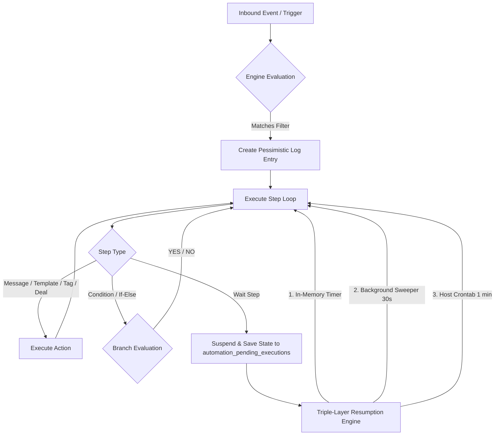

# 🤖 AI-Botflow CRM — Complete Automation Documentation
**Route:** `/automations`

Yeh documentation **AI-Botflow CRM** ke complete **Automation System** ka detailed guide hai. Isme triggers, actions, wait logic, branching conditions, webhook integration, variables templating aur troubleshooting ki puri jankari di gayi hai.

---

## 📌 1. Automation System Architecture Overview

AI-Botflow Automation Engine ek powerful, event-driven workflow execution system hai jo WhatsApp Business API, CRM Deals, Contacts aur Webhooks ko aapas me seamlessly connect karta hai.



---

## ⚡ 2. Triggers (Automation Kab Start Hogi?)

Trigger woh event hota hai jiske hote hi automation execute hoti hai. AI-Botflow me 9 supported triggers hain:

| Trigger ID | Display Name | Kab Trigger Hota Hai? | Required Configuration |
| :--- | :--- | :--- | :--- |
| `keyword_match` | **Keyword Match** | Jab user koi specific word ya phrase message me bheje (e.g., "PRICE", "DEMO", "HELLO"). | • **Keywords:** Words list<br>• **Match Type:** `contains` (substring), `exact` (pura match), ya `word` (whole word)<br>• **Case Sensitive:** On/Off |
| `first_inbound_message` | **First Inbound Message** | Jab koi customer pehli baar message kare (Welcome flow ke liye best). | Koi extra config nahi |
| `new_message_received` | **New Message Received** | Har aane wale message par fire hota hai. | Koi extra config nahi |
| `interactive_reply` | **Interactive Button/List Reply** | Jab user kisi interactive message (Quick Reply button ya List item) par click kare. | • **Reply IDs:** Buttons ya rows ki IDs ka array |
| `tag_added` | **Tag Added to Contact** | Jab kisi contact par manually ya CRM se specific Tag lagta hai. | • **Tag ID:** Target tag select karein |
| `new_contact_created` | **New Contact Created** | Jab system me naya contact register ya import ho. | Koi extra config nahi |
| `incoming_webhook` | **Incoming Webhook** | Facebook Ads, Website Lead Form, IndiaMART, JustDial, ya Shopify se webhook aane par. | • **Phone Path:** JSON payload me phone number ka field path |
| `conversation_assigned` | **Conversation Assigned** | Jab chat kisi specific agent ya team member ko assign ho. | Koi extra config nahi |
| `time_based` | **Scheduled Trigger** | Specific time ya date schedule ke mutabiq. | • **Schedule:** Cron expression / date |

---

## 🛠️ 3. Actions & Steps (Automation Kya Karegi?)

Workflow ke andar multiple steps ko order me lagaya ja sakta hai:

### 1. `send_message` (WhatsApp Text Message)
- Contact ko instant plain text WhatsApp message bhejta hai.
- **Variables Support:** Message body me dynamic placeholders use kar sakte hain (e.g. `Namaste {{name}}, aapka swagat hai!`).

### 2. `send_buttons` (Interactive Quick Replies)
- Contact ko clickable buttons ke sath message send karta hai (Max 3 buttons per Meta policy).
- Customer direct tap karke reply de sakta hai bina type kiye.

### 3. `send_list` (Interactive List Menu)
- Contact ko ek interactive menu card bhejta hai jisme sections aur multiple options hote hain (e.g., "Services", "Pricing", "Support").

### 4. `send_template` (Meta Approved Template)
- WhatsApp Business Cloud API se pre-approved message templates send karta hai.
- **24-Hour Window Bypass:** 24 ghante ke baad bhi agar customer ko message bhejna ho toh Template message hi kaam karta hai.
- Header media (Image/PDF) aur positional parameters `{{1}}`, `{{2}}` automatically contact attributes se map ho jate hain.

### 5. `wait` (Delay Step)
- Workflow ko specified time ke liye pause kar deta hai.
- **Units:** `minutes`, `hours`, `days`.
- *Example:* Pehla message turant bhejo ➔ 15 minute wait karo ➔ Dusra follow-up bhejo.

### 6. `condition` (If / Else Branching)
- Contact ya context ke basis par workflow ko split karta hai do branches me (**YES** aur **NO**):
  - **Tag Presence:** Kya contact ke paas "VIP" tag hai?
  - **Contact Field:** Kya city == "Delhi" hai?
  - **Message Content:** Kya message me "order" likha hai?

### 7. `add_tag` & `remove_tag`
- Contact ko segment karne ke liye tag assign ya remove karta hai (e.g. "Lead", "Interested", "Customer").
- Tag add hone par `tag_added` trigger wali dusri automations bhi trigger ho sakti hain (looping prevention depth guard ke sath).

### 8. `create_deal` (CRM Pipeline Automation)
- Contact ka deal automatically CRM Pipeline ke specified stage me add ya merge kar deta hai.
- Lead Form data ya message text ko deal notes me automatically attach karta hai.
- Account ki default currency (INR/USD) use karta hai.

### 9. `assign_conversation`
- Conversation ko specific team member ya **Round-Robin** mode me distribute kar deta hai.

### 10. `update_contact_field`
- Contact ke name, email, company ya Custom Fields ko update karta hai.

### 11. `send_webhook` (External API Integration)
- Kisi third-party software (Zapier, Make.com, Custom CRM) ko HTTP POST request bhejta hai.
- SSRF protected (internal private IP attacks se surakshit).

### 12. `close_conversation`
- Kaam pura hone ke baad chat ko resolved/closed mark kar deta hai.

---

## ⏳ 4. Wait Mechanism — How Delay Works Reliably

Waiting steps ke liye system me **Triple-Layer Resumption Architecture** implement kiya gaya hai:

```
[Wait Step Hit] ──► Row saved in `automation_pending_executions` with `run_at` timestamp
                         │
        ┌────────────────┼────────────────┐
        ▼                ▼                ▼
   [Layer 1]        [Layer 2]        [Layer 3]
In-Memory Timer   Next.js Sweeper   Host Cron Job
(Wait <= 15 min)    (Every 30s)      (Every 1 min)
        │                │                │
        └────────────────┼────────────────┘
                         ▼
        Claim Pending Execution (Status='running')
                         ▼
             Resume Next Step from Position + 1
```

1. **Short Waits ($\le 15$ Minutes):** Node.js runtime me lightweight `scheduleWaitWakeup` memory timer lagta hai jo exact millisecond par automation resume karta hai.
2. **Medium & Long Waits (Hours & Days):** Next.js background sweeper har 30 seconds me database inspect karta hai.
3. **Server-Level Crontab (VPS):** Hostinger server par `* * * * * curl -s http://localhost:3000/api/automations/cron` configured hai. Server restart ya memory flush hone ke baad bhi koi bhi step miss nahi hota.
4. **Race-Condition Protection:** Multi-worker environment me ek hi message do baar na jaye, iske liye row ko pehle `status = 'running'` me atomically claim kiya jata hai.

---

## 🔤 5. Dynamic Variables (Templating)

Automations ke text messages aur webhook payloads me aap dynamic values interpolate kar sakte hain:

| Variable | Description | Example Output |
| :--- | :--- | :--- |
| `{{name}}` | Contact ka display name | "Rahul Sharma" |
| `{{phone}}` | Contact ka WhatsApp number | "+919876543210" |
| `{{email}}` | Contact ka email address | "rahul@gmail.com" |
| `{{message.text}}` | Jo message customer ne bheja | "Mujhe price list chahiye" |
| `{{vars.field_name}}` | Webhook / Form se aaya hua koi bhi custom variable | `{{vars.city}}`, `{{vars.service}}` |

---

## 🚀 6. Step-by-Step Guide: Common Automation Examples

### Example A: Welcome Flow + Follow-up Drip
- **Goal:** Naye customer ko welcome message bhejna, aur 2 ghante baad follow-up karna.
1. **Trigger:** `first_inbound_message`
2. **Step 1 (`send_message`):** "Namaste {{name}}! AI-Botflow me aapka swagat hai. Hum aapki kya sahayata kar sakte hain?"
3. **Step 2 (`add_tag`):** Tag select karein: `New Lead`
4. **Step 3 (`create_deal`):** Stage select karein: `New Inquiry`
5. **Step 4 (`wait`):** Amount: `2`, Unit: `hours`
6. **Step 5 (`send_message`):** "Namaste {{name}}, kya aapko hamari service ke baare me koi sawal hai? Hamare expert aapse connect karne ke liye ready hain!"

---

### Example B: Keyword Menu with Interactive Buttons
- **Goal:** Jab koi "MENU" bheje toh interactive buttons dikhana.
1. **Trigger:** `keyword_match`
   - Keywords: `MENU`, `PRICE`, `SERVICES`
   - Match Type: `contains`
2. **Step 1 (`send_buttons`):**
   - Header: "AI-Botflow Services"
   - Body: "Neeche diye gaye options me se select karein:"
   - Buttons:
     - `btn_pricing`: 💰 Pricing Plans
     - `btn_demo`: 🎥 Book Demo
     - `btn_support`: 📞 Support

---

### Example C: Facebook / Website Lead Webhook Automation
- **Goal:** Form submit hote hi WhatsApp confirmation bhejna aur deal banana.
1. **Trigger:** `incoming_webhook`
2. **Step 1 (`send_template`):** Pre-approved welcome template select karein.
3. **Step 2 (`add_tag`):** Tag: `Website Lead`
4. **Step 3 (`create_deal`):** Title: `{{name}} - {{vars.service}}`
5. **Step 4 (`assign_conversation`):** Mode: `Round Robin` (Sales team me barabar distribute hoga).

---

## 🔍 7. Monitoring, Logs & Troubleshooting

### Execution Logs Check Kaise Karein?
1. Dashboard me **Automations** tab par jayein.
2. Apni automation ke aage **Three Dots (...)** par click karke **View Logs** select karein (URL: `/automations/[id]/logs`).
3. Wahan har execution ka status dikhega:
   - 🟢 **Success:** Sabhi steps successfully deliver ho gaye.
   - 🟡 **Partial:** Workflow abhi `wait` step par pending hai aur waqt aane par resume hoga.
   - 🔴 **Failed:** Agar Meta API ne message reject kiya (e.g., 24-hr window expired bina template ke ya invalid phone number).

### Best Practices & Rules
- **24-Hour Policy:** Agar customer ne pichle 24 ghante me koi message nahi bheja hai, toh plain text message Meta reject kar deta hai. Aise cases ke liye hamesha **Approved Template** (`send_template`) use karein.
- **Infinite Loop Guard:** Tag triggering automations me system 5-level depth limit enforce karta hai taaki automations aapas me loop na karein.
